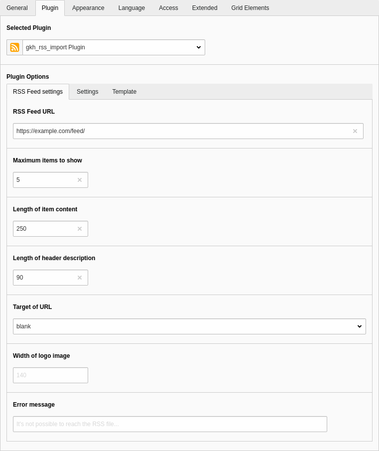
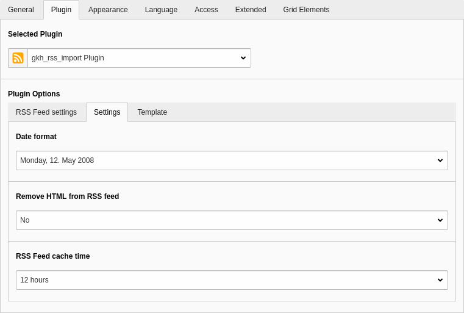
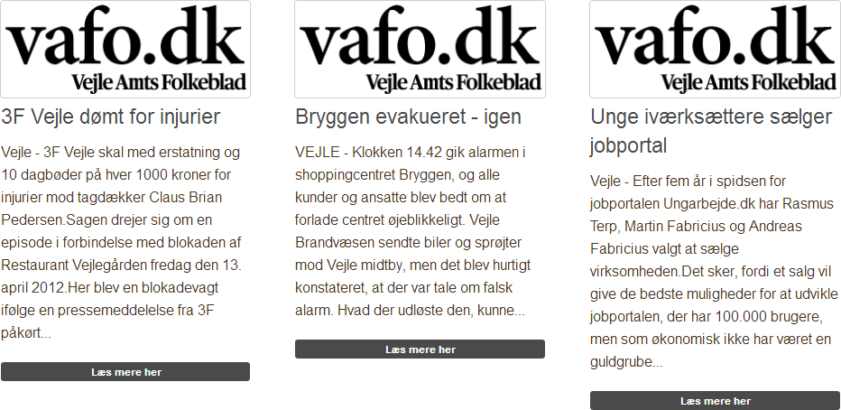

.. include:: ../Includes.txt

.. _introduction:

============
Introduction
============

.. _what-it-does:

What does it do?
================

This extension inserts an RSS feed on a page, and gives you a high level of configuration options.
Included is a function that trims the text to a specified length.
Words are separated by space characters, and they are not chopped if possible.
Logo from pages can be set to a maximum width.
If the feed is encoded with a special language this can be set also.

Several templates are shipped with the extension but you can easily define a new template in the flex form or via TypoScript.

The extension uses the RSS parser from `Last RSS <https://github.com/MikeVister/lastrss>`_ which is modified to work with TYPO3

.. _screenshots:

Screenshots
===========

   General plugin settings

   Additional plugin settings

   Rendered feed example
